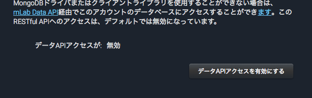

# ReactTasks-width-MongoDB
 `https://mlab.com/`に登録、セットアップ
- そのあと、`create-react-app xxx`でプロジェクト作成
- 不要なファイル削除＋初期設定(svgとかcssとか諸々)
- `npm install --save muicss axios`をインストール
- App.jsを最初の状態にし、MyAppが出るようにする
```js
import React, { Component } from 'react';

import './App.css';

class App extends Component {
  render() {
    return (
      <div className="App">
          My App
      </div>
    );
  }
}

export default App;

//これでnpm startで表示できていればOK
```

## muicssを使えるようにする
- https://www.muicss.com/
- `import {Appbar, Container} from 'muicss/react';`
- public/index.htmlにcssを読み込み ※場所はReact/introduction
```html
<link href="http://cdn.muicss.com/mui-0.9.35/css/mui.min.css" rel="stylesheet" type="text/css" media="screen" />
```
- Musicssに記載されているAppbarのサンプルをコピーして書き換え
```js
//App.js
import React, { Component } from 'react';
import {Appbar, Container} from 'muicss/react';
//Tasksのcomponentを作成して読み込む
import Tasks from './components/Tasks';

import './App.css';

class App extends Component {
  render() {
    return (
      <div className="App">
        <Appbar>
          <Container>
            <table width="100%">
              <tbody>
                <tr>
                  <td className="mui--appbar-height"><h3>React Tasks</h3></td>
                </tr>
              </tbody>
            </table>
          </Container>
        </Appbar>
        <br/>
        <Container>
        //Tasksのcomponentを作成して読み込む
          <Tasks />
        </Container>
      </div>
    );
  }
}

export default App;

```
- src/components/Tasks.jsxを作成
```js
import React, { Component } from 'react';
import {Panel} from 'muicss/react';


class Tasks extends Component {
  render() {
    return (
      <Panel>
        Tasks
      </Panel>
    );
  }
}

export default Tasks;

```

## DB連携（Axios）
- mLabの管理画面/右側ユーザー（自分の名前）をクリック/下の方にAPIkeyとあるのでクリック
- 無事生成できるとapiキーが発行されているのでそれを活用する
- App.jsを追記
```js
//まずaxiosをインポート
import axios from 'axios';


//constructorで状態を定義
constructor(){
  super();
  this.state = {
    tasks: []
  }
}
//ライフサイクルを管理し関数を実行
componentWillMount(){
  this.getTasks();
}
//関数の設定 axiosを使う
getTasks(){
  axios.request({
    method: 'get',
    //ここ注意！管理画面でDisable Data API accessをEnabledにしていないと起動しない！
    url: 'https://api.mlab.com/api/1/databases/reacttask/collections/tasks?apiKey=jTroFZtBVa3L0rbd70SoL9aovA5Om3j3'
  }).then((response) => {
    this.setState({tasks: response.data}, () => {
      console.log(this.state)
    })
  }).catch((error) => {
    console.log(error)
  });
}
```


- これで取れているとconsole.logでmLabに登録したjsonデータが取得できている

```js
<Container>
  <Tasks tasks={this.state.tasks}/>
</Container>
```

- src/components/TaskItemコンポーネントを作成
```js

import React, { Component } from 'react';
import {Checkbox} from 'muicss/react';


class TaskItem extends Component {
  //コンストラクタでpropsを取得
  constructor(props){
    super(props);
    this.state = {
      task: props.task
    }

  }
  render() {
    return (
      <div className="mui--divider-boottom">
      //stateをセット
        <Checkbox name={this.state.task._id.$oid} label={this.state.task.text} defaultChecked={this.state.completed}/>
      </div>
    );
  }
}

export default TaskItem;

```
- Task.jsxを編集
```js
import React, { Component } from 'react';
import {Panel} from 'muicss/react';
import TaskItem from './TaskItem';


class Tasks extends Component {
  render() {
    //条件分岐で設定できるように
    let taskItems;
    if(this.props.tasks){
      taskItems = this.props.tasks.map(task => {
        return (
          <TaskItem key={task._id.$oid} task={task} />
        );
      });
    }

    return (
      <Panel>
      //taskItemsをここにおくことで状態変化によって変わる
      {taskItems}
      </Panel>
    );
  }
}

export default Tasks;
//ここまでできていると取得できたデータがview側に表示されている
```
