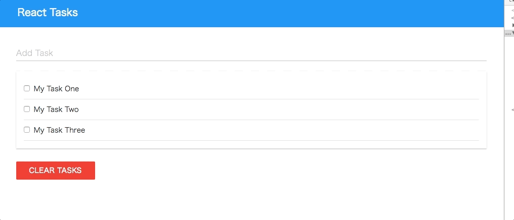

# ReactTasks-width-MongoDB
 `https://mlab.com/`に登録、セットアップ
- そのあと、`create-react-app xxx`でプロジェクト作成
- 不要なファイル削除＋初期設定(svgとかcssとか諸々)
- `npm install --save muicss axios`をインストール
- App.jsを最初の状態にし、MyAppが出るようにする
```js
import React, { Component } from 'react';

import './App.css';

class App extends Component {
  render() {
    return (
      <div className="App">
          My App
      </div>
    );
  }
}

export default App;

//これでnpm startで表示できていればOK
```

## muicssを使えるようにする
- https://www.muicss.com/
- `import {Appbar, Container} from 'muicss/react';`
- public/index.htmlにcssを読み込み ※場所はReact/introduction
```html
<link href="http://cdn.muicss.com/mui-0.9.35/css/mui.min.css" rel="stylesheet" type="text/css" media="screen" />
```
- Musicssに記載されているAppbarのサンプルをコピーして書き換え
```js
//App.js
import React, { Component } from 'react';
import {Appbar, Container} from 'muicss/react';
//Tasksのcomponentを作成して読み込む
import Tasks from './components/Tasks';

import './App.css';

class App extends Component {
  render() {
    return (
      <div className="App">
        <Appbar>
          <Container>
            <table width="100%">
              <tbody>
                <tr>
                  <td className="mui--appbar-height"><h3>React Tasks</h3></td>
                </tr>
              </tbody>
            </table>
          </Container>
        </Appbar>
        <br/>
        <Container>
        //Tasksのcomponentを作成して読み込む
          <Tasks />
        </Container>
      </div>
    );
  }
}

export default App;

```
- src/components/Tasks.jsxを作成
```js
import React, { Component } from 'react';
import {Panel} from 'muicss/react';


class Tasks extends Component {
  render() {
    return (
      <Panel>
        Tasks
      </Panel>
    );
  }
}

export default Tasks;

```

## DB連携（Axios）
- mLabの管理画面/右側ユーザー（自分の名前）をクリック/下の方にAPIkeyとあるのでクリック
- 無事生成できるとapiキーが発行されているのでそれを活用する
- App.jsを追記
```js
//まずaxiosをインポート
import axios from 'axios';


//constructorで状態を定義
constructor(){
  super();
  this.state = {
    tasks: []
  }
}
//ライフサイクルを管理し関数を実行
componentWillMount(){
  this.getTasks();
}
//関数の設定 axiosを使う
getTasks(){
  axios.request({
    method: 'get',
    //ここ注意！管理画面でDisable Data API accessをEnabledにしていないと起動しない！
    url: 'https://api.mlab.com/api/1/databases/reacttask/collections/tasks?apiKey=jTroFZtBVa3L0rbd70SoL9aovA5Om3j3'
  }).then((response) => {
    this.setState({tasks: response.data}, () => {
      console.log(this.state)
    })
  }).catch((error) => {
    console.log(error)
  });
}
```


- これで取れているとconsole.logでmLabに登録したjsonデータが取得できている

```js
<Container>
  <Tasks tasks={this.state.tasks}/>
</Container>
```

- src/components/TaskItemコンポーネントを作成
```js

import React, { Component } from 'react';
import {Checkbox} from 'muicss/react';


class TaskItem extends Component {
  //コンストラクタでpropsを取得
  constructor(props){
    super(props);
    this.state = {
      task: props.task
    }

  }
  render() {
    return (
      <div className="mui--divider-boottom">
      //stateをセット
        <Checkbox name={this.state.task._id.$oid} label={this.state.task.text} defaultChecked={this.state.completed}/>
      </div>
    );
  }
}

export default TaskItem;

```
- Task.jsxを編集
```js
import React, { Component } from 'react';
import {Panel} from 'muicss/react';
import TaskItem from './TaskItem';


class Tasks extends Component {
  render() {
    //条件分岐で設定できるように
    let taskItems;
    if(this.props.tasks){
      taskItems = this.props.tasks.map(task => {
        return (
          <TaskItem key={task._id.$oid} task={task} />
        );
      });
    }

    return (
      <Panel>
      //taskItemsをここにおくことで状態変化によって変わる
      {taskItems}
      </Panel>
    );
  }
}

export default Tasks;
//ここまでできていると取得できたデータがview側に表示されている
```

## タスクのチェックによって変化させる
- TaskItemにイベントを設定
```js
import React, { Component } from 'react';
import {Checkbox} from 'muicss/react';

class TaskItem extends Component {
  constructor(props){
    super(props);
    this.state = {
      task: props.task
    }
  }

  //onChange関数を設定 e.target.checkedで状態を取得できる
  onChange(task, e) {
    this.props.onEditState(task, e.target.checked);
  }

  render() {
    return (
      <div className="mui--divider-bottom">
      //onChangeを設定
        <Checkbox onChange={this.onChange.bind(this, this.state.task)} className={(this.state.task.completed) ? "completed" : ""} name={this.state.task._id.$oid} label={this.state.task.text} defaultChecked={this.state.task.completed} />
      </div>
    );
  }
}

export default TaskItem;

```
- Task.jsを編集
```js
class Tasks extends Component {
  //eventハンドラを定義
  handleEditState(task, checked){
    this.props.onEditState(task, checked);
  }

  render() {
    let taskItems;
    if(this.props.tasks){
      taskItems = this.props.tasks.map(task => {
        return (
          //eventを設定
          <TaskItem onEditState={this.handleEditState.bind(this)} key={task._id.$oid} task={task} />
        );
      });
    }

    return (
      <Panel>
      {taskItems}
      </Panel>
    );
  }
}

```
- App.js
```js

//event
editState(task, checked) {
  //これでtrue/falseが取得できているかどうかを確認できる
  console.log(checked);
}

//省略
</Appbar>
<br/>
<Container>
  //eventを設定
  <Tasks onEditState={this.editState.bind(this)} tasks={this.state.tasks}/>
</Container>
</div>

↓これができた上で書き換える

//axiosでputを利用
  editState(task, checked) {
    axios.request({
      method: 'put',
      url: 'https://api.mlab.com/api/1/databases/reacttask/collections/tasks/'+task._id.$oid+'?apiKey=jTroFZtBVa3L0rbd70SoL9aovA5Om3j3',
      //状態を管理
      data: {
        text: task.text,
        completed: checked
      }
    }).then((response) => {
      let tasks = this.state.tasks;
      //for文ですべてチェック
      for(let i = 0; i < tasks.length; i++){
        if(tasks[i]._id.$oid === response.data._id.$oid){
          tasks[i].completed = checked;
        }
      }
      this.setState({tasks: tasks});
    }).catch((error) => {
      console.log(error)
    });
  }

//これでチェック線が入り、リロードしてもチェックしているものにはそのままスタイルが適用されている
```

## クリア設定機能の追加
- src/components/AddTask.jsを追加
```js
import React, { Component } from 'react';
import {Form, Input} from 'muicss/react';

class AddTask extends Component {
  constructor(props){
    super(props);
    this.state = {
      task: ''
    }
  }

  onSubmit(e) {
    this.props.onAddTask(this.state.task);
    e.preventDefault();
  }

  onChange(e) {
    this.setState({task: e.target.value});
  }

  render() {
    return (
      <Form onSubmit={this.onSubmit.bind(this)}>
        <Input hint="Add Task" onChange={this.onChange.bind(this)} />
      </Form>
    );
  }
}

export default AddTask;

```
- 作成したAddTaskをApp.jsにインポート
```js
import AddTask from './components/AddTask';


addTask(text){
  //まずこれでフォームのインプットから入力したものが取得できるかチェック
  console.log(text);

  //取得できていることを確認できたら書き換え
  addTask(text){
    axios.request({
      method: 'post',
      url: 'https://api.mlab.com/api/1/databases/reacttask/collections/tasks/?apiKey=jTroFZtBVa3L0rbd70SoL9aovA5Om3j3',
      data: {
        text: text,
        completed: false
      }
    }).then((response) => {
      let tasks = this.state.tasks;
      tasks.push({
        _id: response.data._id,
        text: text,
        completed: false
      })
      this.setState({tasks: tasks});
    }).catch((error) => {
      console.log(error)
    });
  }
  //この処理でタスクが追加できるようになっている
}
```
- タスクをクリアする機能実装
```js
//Buttonを追加
import {Appbar, Container, Button} from 'muicss/react';

//省略
<Container>
  <AddTask onAddTask={this.addTask.bind(this)} />
  <Tasks onEditState={this.editState.bind(this)} tasks={this.state.tasks}/>
  //Buttonを読み込み、イベントを設定
  <Button color="danger" onClick={this.clearTasks.bind(this)}>Clear Tasks</Button>
</Container>


//clearTasksを設定
  clearTasks(){
    let tasks = this.state.tasks;
    let i = tasks.length;

    while(i--){
      if(tasks[i].completed === true){
        let id = tasks[i]._id.$oid;
        tasks.splice(i, i);
        axios.request({
          method: 'delete',
          url: 'https://api.mlab.com/api/1/databases/reacttask/collections/tasks/'+id+'?apiKey=jTroFZtBVa3L0rbd70SoL9aovA5Om3j3'
        }).then((response) => {

        }).catch((error) => {
          console.log(error);
        });
      }
    }
    this.setState({tasks: tasks});
  }

```
## 完成図

